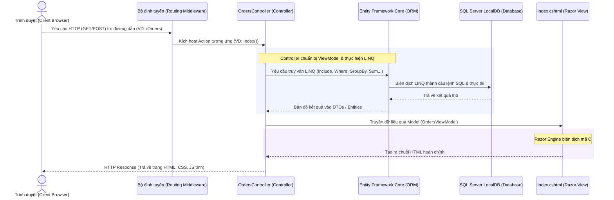

# HƯỚNG DẪN KIẾN THỨC VÀ PHÂN TÍCH TOÀN BỘ DỰ ÁN (PROJECT KNOWLEDGE & FLOW ANALYSIS)

Dự án này là một ứng dụng quản lý đơn hàng tối giản được xây dựng theo mô hình **ASP.NET Core MVC (Model-View-Controller)** sử dụng **Entity Framework Core (EF Core)** làm ORM để làm việc với cơ sở dữ liệu **SQL Server LocalDB**, kết hợp các truy vấn dữ liệu thông qua **LINQ (Language Integrated Query)**.

Dưới đây là tài liệu phân tích chi tiết về luồng hoạt động (flow), kiến trúc và ý nghĩa của từng đoạn code trong hệ thống.

---

## 1. LUỒNG HOẠT ĐỘNG TOÀN DIỆN (APPLICATION WORKFLOW)

Hệ thống hoạt động theo luồng MVC Server-Side Rendering (khi người dùng thao tác, trình duyệt gửi yêu cầu lên server, server xử lý, truy vấn DB, tạo ra HTML hoàn chỉnh và trả lại cho trình duyệt để hiển thị). Không có các cuộc gọi API AJAX chạy ngầm để tải dữ liệu.

### Biểu đồ Luồng Đi (Request - Response Lifecycle)



### Luồng nghiệp vụ chi tiết của từng chức năng:

1. **Hiển thị mặc định (Xem danh sách đơn hàng)**:
   - Người dùng truy cập `http://localhost:5093`.
   - Bộ định tuyến chuyển tiếp đến `OrdersController.Index`.
   - Controller lấy danh sách tất cả các khách hàng để đổ vào Dropdown tạo đơn hàng mới.
   - Controller truy vấn danh sách đơn hàng bằng EF Core, nạp kèm dữ liệu khách hàng tương ứng (Eager Loading bằng lệnh `.Include(o => o.Customer)`).
   - Dữ liệu được sắp xếp giảm dần theo thời gian tạo đơn hàng (`.OrderByDescending(o => o.OrderDate)`).
   - Các chỉ số thống kê (Tổng doanh thu đơn hàng đã hoàn thành, tổng số đơn hàng, số lượng đơn theo từng trạng thái) được tính toán bằng các hàm LINQ (`SumAsync`, `CountAsync`, `GroupBy`).
   - Mọi thông tin được chuyển vào `OrdersViewModel` rồi gửi đến `Index.cshtml` để render ra giao diện.

2. **Tìm kiếm & Lọc (Search & Filter)**:
   - Khi nhập từ khóa tìm kiếm (tên khách hàng) hoặc chọn một trạng thái trong Dropdown, một Form HTML dạng **GET** được gửi lên server.
   - Form này chứa tham số truy vấn trên thanh địa chỉ, ví dụ: `?searchString=Alice` hoặc `?statusFilter=Pending`.
   - Action `Index` nhận các tham số này, áp dụng bộ lọc LINQ `.Where(...)` động tương ứng vào truy vấn và tải lại trang hiển thị kết quả lọc. Đồng thời, khung hiển thị câu lệnh LINQ ở góc phải sẽ tự động hiển thị câu lệnh LINQ tương ứng giúp giảng viên/người xem hiểu được cách thức lọc dữ liệu trong C#.

3. **Xem Top 5 Đơn hàng có Giá trị Lớn nhất (Top 5 Orders)**:
   - Người dùng bấm nút "Top 5 Orders", trình duyệt gửi yêu cầu `GET /Orders?showTop5=true`.
   - LINQ áp dụng phương thức `.OrderByDescending(o => o.TotalAmount).Take(5)`.
   - Giao diện tải lại chỉ hiển thị tối đa 5 đơn hàng đắt nhất, đồng thời khung LINQ hiển thị đoạn code tương ứng.

4. **Tạo Đơn hàng Mới (Create)**:
   - Người dùng bấm nút "+ Create New Order", mở Modal biểu mẫu nhập liệu.
   - Khi điền xong dữ liệu và bấm "Save Order", trình duyệt gửi một yêu cầu **POST** đến `/Orders/Create`.
   - Controller nhận dữ liệu, kiểm tra tính hợp lệ bằng các logic nghiệp vụ (Kiểm tra xem CustomerId có tồn tại trong DB không bằng `.AnyAsync()`, kiểm tra số tiền nhập vào có > 0 không).
   - Nếu hợp lệ, đơn hàng mới được thêm vào DB bằng phương thức `_context.Orders.Add()` và lưu lại qua `_context.SaveChangesAsync()`.
   - Sau đó, Controller gán thông báo thành công vào bộ nhớ tạm `TempData["SuccessMessage"]` và thực hiện chuyển hướng (`RedirectToAction(nameof(Index))`) để tải lại trang chủ sạch sẽ.

5. **Cập nhật Trạng thái Đơn hàng (Update Status)**:
   - Người dùng đổi giá trị trong Dropdown trạng thái của một dòng trong bảng đơn hàng.
   - Sự kiện đổi giá trị kích hoạt trình duyệt tự động gửi (submit) một Form HTML dạng **POST** ngầm chứa ID đơn hàng và trạng thái mới gửi đến `/Orders/UpdateStatus`.
   - Controller tìm đơn hàng trong cơ sở dữ liệu bằng `.FirstOrDefaultAsync(o => o.Id == id)`.
   - Cập nhật thuộc tính `Status` của thực thể đó và lưu lại.
   - Chuyển hướng về trang chủ và hiển thị banner thông báo cập nhật thành công.

6. **Xóa Đơn hàng (Delete)**:
   - Người dùng nhấn nút "Delete" ở cột hành động, trình duyệt yêu cầu xác nhận xác nhận xóa thông qua Javascript popup.
   - Nếu chọn Yes, Form POST được gửi lên `/Orders/Delete`.
   - Controller thực hiện tìm đơn hàng, gọi lệnh xóa `_context.Orders.Remove(order)`, lưu thay đổi vào DB và chuyển hướng về trang chủ hiển thị thông báo.

---

## 2. PHÂN TÍCH CHI TIẾT TỪNG PHÂN ĐOẠN MÃ NGUỒN (CODE EXPLANATIONS)

### 2.1 CẤU HÌNH HỆ THỐNG VÀ KHỞI TẠO DỰ ÁN (`Program.cs`)

Tệp tin này cấu hình vòng đời của ứng dụng Web, đăng ký dịch vụ và thiết lập Middleware.

```csharp
// Program.cs
using Microsoft.EntityFrameworkCore;
using OrderManagementSystem.Data;

var builder = WebApplication.CreateBuilder(args);

// Đăng ký dịch vụ hỗ trợ mô hình MVC (Controller kèm Razor Views)
builder.Services.AddControllersWithViews();

// Đăng ký DbContext với EF Core để kết nối CSDL SQL Server sử dụng chuỗi kết nối (ConnectionString) cấu hình trong appsettings.json
builder.Services.AddDbContext<OrderDbContext>(options =>
    options.UseSqlServer(builder.Configuration.GetConnectionString("DefaultConnection")));
```
* **Ý nghĩa**:
  - `AddControllersWithViews()` kích hoạt các chức năng xử lý giao diện HTML máy chủ (Razor Views) thay vì chỉ hỗ trợ các Web API thuần túy.
  - `AddDbContext<OrderDbContext>` khai báo lớp quản lý cơ sở dữ liệu trong hệ thống, cấu hình cơ sở dữ liệu đích sử dụng nhà cung cấp SQL Server.

```csharp
var app = builder.Build();

// Tự động tạo và nạp dữ liệu mẫu (Seed Data) vào CSDL khi ứng dụng vừa khởi động
using (var scope = app.Services.CreateScope())
{
    var services = scope.ServiceProvider;
    try
    {
        var context = services.GetRequiredService<OrderDbContext>();
        // EnsureCreated() kiểm tra xem Database đã tồn tại chưa. Nếu chưa, nó sẽ tạo Database mới và chạy các cấu hình Seed Data trong DBContext.
        context.Database.EnsureCreated();
    }
    catch (Exception ex)
    {
        // Ghi lại lỗi nếu có trục trặc trong quá trình khởi tạo CSDL
        app.Logger.LogError(ex, "An error occurred while seeding/initializing the database.");
    }
}
```
* **Ý nghĩa**:
  - Khối `using` tạo ra một phạm vi vòng đời tạm thời để lấy dịch vụ `OrderDbContext` ra một cách an toàn.
  - `EnsureCreated()` giúp sinh viên không cần chạy lệnh Migration thủ công (`Add-Migration` / `Update-Database`), cơ sở dữ liệu sẽ tự động được sinh ra ngay khi chạy chương trình lần đầu tiên, giảm thiểu lỗi thiết lập môi trường.

```csharp
// Cấu hình Pipeline xử lý yêu cầu HTTP
app.UseHttpsRedirection();
app.UseStaticFiles(); // Cho phép đọc các file tĩnh trong thư mục wwwroot (như css/styles.css, các file JS tĩnh)
app.UseRouting();

// Cấu hình đường đi mặc định của MVC: Nếu truy cập trang chủ (/), hệ thống tự động hướng tới OrdersController và chạy Action Index
app.MapControllerRoute(
    name: "default",
    pattern: "{controller=Orders}/{action=Index}/{id?}");

app.Run();
```
* **Ý nghĩa**:
  - `UseStaticFiles()` cực kỳ quan trọng để trình duyệt tải được file stylesheet `wwwroot/css/styles.css`.
  - `MapControllerRoute` là trái tim điều phối của MVC, thiết lập quy tắc URL thân thiện cho người dùng.

---

### 2.2 CƠ SỞ DỮ LIỆU VÀ SEED DATA (`Data/OrderDbContext.cs`)

Lớp cầu nối giữa mã nguồn C# và cơ sở dữ liệu SQL Server.

```csharp
// Data/OrderDbContext.cs
using Microsoft.EntityFrameworkCore;
using OrderManagementSystem.Models;

namespace OrderManagementSystem.Data
{
    public class OrderDbContext : DbContext
    {
        public OrderDbContext(DbContextOptions<OrderDbContext> options) : base(options)
        {
        }

        // Định nghĩa bảng dữ liệu tương ứng trong Database
        public DbSet<Customer> Customers { get; set; } = null!;
        public DbSet<Order> Orders { get; set; } = null!;
```
* **Ý nghĩa**:
  - `DbSet<Customer>` ánh xạ lớp thực thể C# `Customer` thành bảng `Customers` trong SQL Server.
  - `DbSet<Order>` ánh xạ thực thể `Order` thành bảng `Orders` trong SQL Server.

```csharp
        protected override void OnModelCreating(ModelBuilder modelBuilder)
        {
            base.OnModelCreating(modelBuilder);

            // Cấu hình quan hệ một-nhiều (One-to-Many Relationship)
            modelBuilder.Entity<Order>()
                .HasOne(o => o.Customer)              // Một Order có duy nhất một Customer đại diện
                .WithMany(c => c.Orders)              // Một Customer có thể có nhiều Orders liên kết
                .HasForeignKey(o => o.CustomerId)    // Khóa ngoại liên kết là CustomerId trong bảng Orders
                .OnDelete(DeleteBehavior.Cascade);    // Khi xóa một Customer, toàn bộ đơn hàng liên quan sẽ bị xóa tự động (Cascade Delete)

            // Cấu hình kiểu dữ liệu tiền tệ chính xác trong DB cho TotalAmount (18 chữ số, 2 chữ số thập phân sau dấu phẩy)
            modelBuilder.Entity<Order>()
                .Property(o => o.TotalAmount)
                .HasPrecision(18, 2);
```
* **Ý nghĩa**:
  - Thiết lập khóa ngoại và hành vi xóa móc nối (Cascade Delete) nhằm bảo đảm toàn vẹn dữ liệu trong CSDL.
  - Cấu hình độ chính xác decimal giúp tránh các lỗi làm tròn số tiền của hóa đơn khi thao tác số học lớn.

```csharp
            // Nạp dữ liệu mẫu cho khách hàng (Customer Seed Data)
            modelBuilder.Entity<Customer>().HasData(
                new Customer { Id = 1, Name = "Alice Smith", Email = "alice.smith@example.com" },
                new Customer { Id = 2, Name = "Bob Jones", Email = "bob.jones@example.com" },
                new Customer { Id = 3, Name = "Charlie Brown", Email = "charlie.brown@example.com" },
                new Customer { Id = 4, Name = "David Miller", Email = "david.miller@example.com" },
                new Customer { Id = 5, Name = "Eva Green", Email = "eva.green@example.com" }
            );

            // Nạp dữ liệu mẫu cho các đơn hàng tương ứng (Order Seed Data)
            modelBuilder.Entity<Order>().HasData(
                new Order { Id = 1, CustomerId = 1, OrderDate = DateTime.UtcNow.AddDays(-10), TotalAmount = 150000, Status = "Completed" },
                new Order { Id = 2, CustomerId = 2, OrderDate = DateTime.UtcNow.AddDays(-8), TotalAmount = 350000, Status = "Completed" },
                new Order { Id = 3, CustomerId = 1, OrderDate = DateTime.UtcNow.AddDays(-6), TotalAmount = 1200000, Status = "Processing" },
                // ...
            );
        }
    }
}
```
* **Ý nghĩa**:
  - Dữ liệu mẫu này được tự động chèn vào bảng ngay khi tạo DB để người dùng/giảng viên thấy ngay danh sách đơn hàng đã điền sẵn thông tin trực quan khi vừa khởi động ứng dụng.

---

### 2.3 CÁC LỚP MÔ HÌNH VÀ DỰ LIỆU (MODELS & VIEWMODELS)

#### Thực thể Khách hàng (`Models/Customer.cs`)
```csharp
namespace OrderManagementSystem.Models
{
    public class Customer
    {
        public int Id { get; set; }
        public string Name { get; set; } = string.Empty;
        public string Email { get; set; } = string.Empty;

        // Thuộc tính điều hướng biểu thị một khách hàng có một danh sách đơn hàng
        public ICollection<Order> Orders { get; set; } = new List<Order>();
    }
}
```

#### Thực thể Đơn hàng (`Models/Order.cs`)
```csharp
using System.Text.Json.Serialization;

namespace OrderManagementSystem.Models
{
    public class Order
    {
        public int Id { get; set; }
        public int CustomerId { get; set; }
        public DateTime OrderDate { get; set; } = DateTime.UtcNow;
        public decimal TotalAmount { get; set; }
        public string Status { get; set; } = "Pending"; // Pending, Processing, Completed, Cancelled

        // Thuộc tính điều hướng liên kết ngược lại thực thể Customer
        [JsonIgnore]
        public Customer? Customer { get; set; }
    }
}
```

#### Mô hình hiển thị giao diện (`Models/OrdersViewModel.cs`)
Đây là lớp dữ liệu đặc thù gom tất cả thông tin mà trang HTML `Index.cshtml` cần để hiển thị.

```csharp
using System.Collections.Generic;
using OrderManagementSystem.DTOs;

namespace OrderManagementSystem.Models
{
    public class OrdersViewModel
    {
        // Chứa danh sách dữ liệu truyền lên giao diện
        public List<OrderResponseDto> Orders { get; set; } = new List<OrderResponseDto>();
        public List<CustomerDto> Customers { get; set; } = new List<CustomerDto>();

        // Chứa các thông số thống kê
        public decimal TotalRevenue { get; set; }
        public int TotalOrders { get; set; }
        public Dictionary<string, int> StatusStats { get; set; } = new Dictionary<string, int>();

        // Giữ lại trạng thái lọc của thanh tìm kiếm để hiển thị đúng dữ liệu đang chọn trên giao diện
        public string SearchString { get; set; } = string.Empty;
        public string StatusFilter { get; set; } = string.Empty;
        public bool ShowTop5 { get; set; }

        // Biến lưu trữ chuỗi mô tả và chuỗi code LINQ đang chạy để hiển thị trực quan lên góc phải giao diện
        public string ActiveLinqDesc { get; set; } = string.Empty;
        public string ActiveLinqCode { get; set; } = string.Empty;
    }
}
```
* **Ý nghĩa**:
  - Việc gom nhóm này giúp View hoạt động kiểu "Strongly-typed" (có kiểu dữ liệu tường minh), tránh sử dụng các đối tượng lỏng lẻo như `ViewBag` hay `ViewData` vốn dễ gây ra lỗi đánh máy trong mã Razor.

---

### 2.4 BỘ ĐIỀU KHIỂN CHÍNH (`Controllers/OrdersController.cs`)

Đây là nơi chứa toàn bộ logic xử lý chính của chương trình.

#### 1. Hành động tải trang chủ và thực thi LINQ (`Index`)
```csharp
        [HttpGet]
        [Route("")]
        [Route("Orders")]
        [Route("Orders/Index")]
        public async Task<IActionResult> Index(string searchString, string statusFilter, bool showTop5 = false, string highlightLinqKey = "")
        {
            var viewModel = new OrdersViewModel
            {
                SearchString = searchString,
                StatusFilter = statusFilter,
                ShowTop5 = showTop5
            };

            // 1. LINQ: Tải danh sách khách hàng xếp theo bảng chữ cái để phục vụ dropdown tạo đơn hàng
            viewModel.Customers = await _context.Customers
                .OrderBy(c => c.Name)
                .Select(c => new CustomerDto
                {
                    Id = c.Id,
                    Name = c.Name,
                    Email = c.Email
                })
                .ToListAsync();
```

Tiếp theo, xây dựng câu truy vấn lọc động dựa trên tham số truyền vào:
```csharp
            // 2. Tạo câu lệnh truy vấn thô liên kết thông tin khách hàng (Include - Eager Loading)
            IQueryable<Order> query = _context.Orders.Include(o => o.Customer);

            if (showTop5)
            {
                // LINQ: Sắp xếp giảm dần theo doanh thu và lấy ra 5 bản ghi lớn nhất
                query = query.OrderByDescending(o => o.TotalAmount).Take(5);

                viewModel.ActiveLinqDesc = "Sort all orders descending by TotalAmount and retrieve the first 5 records.";
                viewModel.ActiveLinqCode = "var orders = await _context.Orders\n    .Include(o => o.Customer)\n    .OrderByDescending(o => o.TotalAmount)\n    .Take(5)\n    .ToListAsync();";
            }
            else if (!string.IsNullOrWhiteSpace(statusFilter))
            {
                // LINQ: Lọc theo trạng thái và sắp xếp theo ngày mới nhất
                query = query.Where(o => o.Status == statusFilter).OrderByDescending(o => o.OrderDate);

                viewModel.ActiveLinqDesc = $"Filter orders that match the specified status '{statusFilter}'.";
                viewModel.ActiveLinqCode = $"var orders = await _context.Orders\n    .Include(o => o.Customer)\n    .Where(o => o.Status == \"{statusFilter}\")\n    .OrderByDescending(o => o.OrderDate)\n    .ToListAsync();";
            }
            else if (!string.IsNullOrWhiteSpace(searchString))
            {
                // LINQ: Lọc theo tên khách hàng chứa từ khóa tìm kiếm (bằng Contains tương đương LIKE '%keyword%' trong SQL)
                query = query.Where(o => o.Customer != null && o.Customer.Name.Contains(searchString)).OrderByDescending(o => o.OrderDate);

                viewModel.ActiveLinqDesc = $"Search for orders where the related customer's name contains '{searchString}'.";
                viewModel.ActiveLinqCode = $"var orders = await _context.Orders\n    .Include(o => o.Customer)\n    .Where(o => o.Customer.Name.Contains(\"{searchString}\"))\n    .OrderByDescending(o => o.OrderDate)\n    .ToListAsync();";
            }
            else
            {
                // LINQ: Luồng mặc định hiển thị toàn bộ đơn hàng mới nhất
                query = query.OrderByDescending(o => o.OrderDate);

                viewModel.ActiveLinqDesc = "Retrieve all orders, eagerly load the related Customer details, and sort by date descending.";
                viewModel.ActiveLinqCode = "var orders = await _context.Orders\n    .Include(o => o.Customer)\n    .OrderByDescending(o => o.OrderDate)\n    .ToListAsync();";
            }

            // Thực thi truy vấn xuống SQL Server
            var ordersList = await query.ToListAsync();
            viewModel.Orders = ordersList.Select(o => new OrderResponseDto
            {
                Id = o.Id,
                CustomerId = o.CustomerId,
                CustomerName = o.Customer != null ? o.Customer.Name : "Unknown",
                OrderDate = o.OrderDate,
                TotalAmount = o.TotalAmount,
                Status = o.Status
            }).ToList();
```

Tính toán các số liệu thống kê ở hàng trên cùng của giao diện:
```csharp
            // 3. Tính toán thống kê toàn cục sử dụng LINQ
            
            // LINQ: Đếm tổng số đơn hàng hiện tại (.CountAsync())
            viewModel.TotalOrders = await _context.Orders.CountAsync();

            // LINQ: Lọc đơn hàng hoàn thành (Completed) và tính tổng tiền (.SumAsync())
            viewModel.TotalRevenue = await _context.Orders
                .Where(o => o.Status == "Completed")
                .SumAsync(o => o.TotalAmount);

            // LINQ: Gom nhóm theo trạng thái và đếm số lượng mỗi nhóm (.GroupBy())
            var stats = await _context.Orders
                .GroupBy(o => o.Status)
                .Select(g => new
                {
                    Status = g.Key,
                    Count = g.Count()
                })
                .ToListAsync();

            viewModel.StatusStats = stats.ToDictionary(s => s.Status, s => s.Count);
```
* **Ý nghĩa**:
  - `query` được khai báo dạng `IQueryable` giúp trì hoãn việc chạy lệnh SQL (Deferred Execution). Nghĩa là các câu lệnh `.Where()`, `.OrderByDescending()` được cộng dồn lại thành một bộ lọc đầy đủ, sau đó khi gọi `ToListAsync()` thì hệ thống mới chạy duy nhất một câu lệnh SQL hoàn chỉnh xuống DB, tối ưu hóa hiệu năng hệ thống.

#### 2. Hành động tạo đơn hàng mới (`Create`)
```csharp
        [HttpPost]
        [Route("Orders/Create")]
        public async Task<IActionResult> Create(int customerId, decimal totalAmount, string status)
        {
            // LINQ: Sử dụng AnyAsync() để kiểm tra nhanh xem ID khách hàng nhập vào có tồn tại thực sự không
            var customerExists = await _context.Customers.AnyAsync(c => c.Id == customerId);
            if (!customerExists)
            {
                TempData["ErrorMessage"] = "Customer does not exist.";
                return RedirectToAction(nameof(Index));
            }

            if (totalAmount <= 0)
            {
                TempData["ErrorMessage"] = "Amount must be greater than 0.";
                return RedirectToAction(nameof(Index));
            }

            var newOrder = new Order
            {
                CustomerId = customerId,
                TotalAmount = totalAmount,
                Status = status,
                OrderDate = DateTime.UtcNow
            };

            _context.Orders.Add(newOrder); // Đưa vào hàng chờ thêm mới của EF Core
            await _context.SaveChangesAsync(); // Đồng bộ và lưu vĩnh viễn vào DB SQL Server

            TempData["SuccessMessage"] = $"Order #{newOrder.Id} created successfully!";
            return RedirectToAction(nameof(Index));
        }
```
* **Ý nghĩa**:
  - Sử dụng `TempData` để lưu trữ dữ liệu thông báo ngắn hạn qua một chu kỳ Request mới (sau khi chuyển hướng trang bằng `RedirectToAction`).

---

### 2.5 GIAO DIỆN HIỂN THỊ RAZOR VIEW (`Views/Orders/Index.cshtml`)

Giao diện được render động trên Server. Hãy xem phân đoạn quan trọng kết nối C# và HTML.

#### Hiển thị thông báo TempData:
```html
@if (TempData["SuccessMessage"] != null)
{
    <div class="alert alert-success">
        @TempData["SuccessMessage"]
    </div>
}
```

#### Thẻ hiển thị thống kê Tổng số tiền (LINQ Sum):
```html
<a href="/Orders?highlightLinqKey=revenue" class="summary-box">
    <span class="summary-title">Total Revenue (Completed)</span>
    <strong class="text-success">@Model.TotalRevenue.ToString("N0") ₫</strong>
</a>
```
* Bấm vào ô thống kê doanh thu sẽ kích hoạt tham số `highlightLinqKey=revenue` trên URL, báo cho Controller biết để in ra đoạn code LINQ của phần tính tổng Sum lên bảng giải thích.

#### Duyệt danh sách đơn hàng đổ dữ liệu vào bảng (Razor foreach loop):
```html
@foreach (var order in Model.Orders)
{
    <tr>
        <td><span class="order-id-badge">#@order.Id</span></td>
        <td>
            <div class="customer-name-cell">@order.CustomerName</div>
        </td>
        <td>
            <span class="badge badge-@order.Status.ToLower()">@order.Status</span>
        </td>
        <td>
            <!-- Form POST cập nhật trạng thái nhanh bằng Dropdown -->
            <form method="post" action="/Orders/UpdateStatus" style="display:inline;">
                <input type="hidden" name="id" value="@order.Id" />
                <select name="status" onchange="this.form.submit()">
                    <option value="Pending" selected="@(order.Status == "Pending" ? "selected" : null)">Pending</option>
                    <option value="Processing" selected="@(order.Status == "Processing" ? "selected" : null)">Processing</option>
                    <option value="Completed" selected="@(order.Status == "Completed" ? "selected" : null)">Completed</option>
                    <option value="Cancelled" selected="@(order.Status == "Cancelled" ? "selected" : null)">Cancelled</option>
                </select>
            </form>
        </td>
    </tr>
}
```
* **Ý nghĩa**:
  - Thuộc tính `onchange="this.form.submit()"` trong thẻ `<select>` giúp thực hiện việc tự động gửi form POST lên máy chủ mà không cần viết các đoạn code Javascript gửi dữ liệu AJAX phức tạp. Đúng chuẩn luồng MVC truyền thống.

---

## 3. TỔNG HỢP CÁC PHÉP TRUY VẤN LINQ TRONG DỰ ÁN

| Chức năng | Phép truy vấn LINQ | Giải thích ý nghĩa |
| :--- | :--- | :--- |
| **Eager Loading** | `query.Include(o => o.Customer)` | Liên kết bảng Orders với bảng Customers để lấy tên khách hàng trong cùng 1 câu lệnh SQL truy vấn |
| **Lọc theo trạng thái** | `query.Where(o => o.Status == statusFilter)` | Chỉ lấy ra các đơn hàng thỏa mãn điều kiện trạng thái truyền vào |
| **Tìm kiếm từ khóa** | `query.Where(o => o.Customer.Name.Contains(searchString))` | Tìm khách hàng có tên chứa từ khóa tìm kiếm (so khớp chuỗi) |
| **Lấy Top 5 lớn nhất** | `query.OrderByDescending(o => o.TotalAmount).Take(5)` | Sắp xếp giá trị đơn hàng giảm dần và giới hạn lấy 5 bản ghi đầu tiên |
| **Tính tổng doanh thu**| `_context.Orders.Where(o => o.Status == "Completed").SumAsync(o => o.TotalAmount)` | Tính tổng tiền của tất cả các hóa đơn có trạng thái là đã hoàn tất |
| **Phân tích số liệu** | `_context.Orders.GroupBy(o => o.Status).Select(g => new { Status = g.Key, Count = g.Count() })` | Gom nhóm đơn hàng theo các trạng thái khác nhau và đếm số lượng bản ghi của mỗi nhóm |
| **Kiểm tra tồn tại** | `_context.Customers.AnyAsync(c => c.Id == customerId)` | Trả về True/False xem khách hàng đó có tồn tại trong cơ sở dữ liệu để liên kết đơn hàng hay không |
