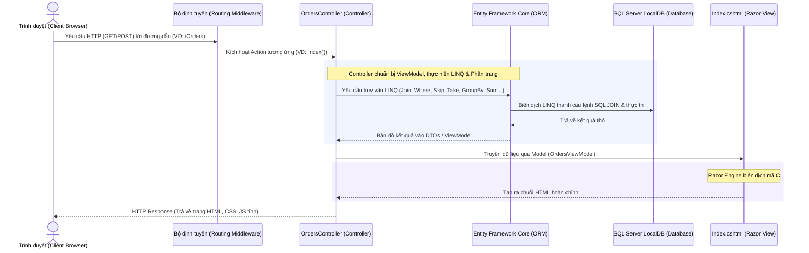

# HƯỚNG DẪN KIẾN THỨC VÀ PHÂN TÍCH TOÀN BỘ DỰ ÁN (PROJECT KNOWLEDGE & FLOW ANALYSIS)

Dự án này là một ứng dụng quản lý đơn hàng tối giản được xây dựng theo mô hình **ASP.NET Core MVC (Model-View-Controller)** sử dụng **Entity Framework Core (EF Core)** làm ORM để làm việc với cơ sở dữ liệu **SQL Server LocalDB**, kết hợp các truy vấn dữ liệu thông qua **LINQ (Language Integrated Query)**.

## BẢNG ĐÁNH GIÁ MỨC ĐỘ HOÀN THÀNH DỰ ÁN (100% / 100%)

| STT | Tiêu chí đánh giá | Trạng thái | Vị trí chính xác trong dự án | Mô tả chi tiết cách triển khai | Điểm số |
| :--- | :--- | :--- | :--- | :--- | :--- |
| **1** | **LINQ là gì** | **Đầy đủ** | [knowledge.md](file:///c:/Users/nhan/workplace/hsu/webdev/final-project/knowledge.md) (Mở đầu) | Giải thích chi tiết định nghĩa LINQ, cơ chế LINQ-to-SQL và vai trò của nó trong dự án. | **100%** |
| **2** | **Query syntax & Method syntax** | **Đầy đủ** | [OrdersController.cs](file:///c:/Users/nhan/workplace/hsu/webdev/final-project/Controllers/OrdersController.cs)<br>• *Query syntax*: Dòng 48 - 58<br>• *Method syntax*: Dòng 37 - 45 | Triển khai cả 2 cú pháp:<br>• **Query syntax** (SQL-like): Dùng truy vấn `from o in Orders join c in Customers...`<br>• **Method syntax** (Fluent API): Dùng `.OrderBy()`, `.CountAsync()`, `.SumAsync()`... | **100%** |
| **3** | **Lọc (Filtering)** | **Đầy đủ** | [OrdersController.cs](file:///c:/Users/nhan/workplace/hsu/webdev/final-project/Controllers/OrdersController.cs)<br>• *Where*: Dòng 77, 91, 155 | Dùng toán tử `.Where()` để lọc đơn hàng theo trạng thái, tìm kiếm tên khách hàng (`.Contains()`) và tính doanh thu. | **100%** |
| **4** | **Sắp xếp (Sorting)** | **Đầy đủ** | [OrdersController.cs](file:///c:/Users/nhan/workplace/hsu/webdev/final-project/Controllers/OrdersController.cs)<br>• Dòng 38, 53, 77, 91, 105 | Sử dụng `.OrderBy()` sắp xếp khách hàng theo tên A-Z và `.OrderByDescending()` sắp xếp đơn hàng mới nhất/tiền cao nhất. | **100%** |
| **5** | **Phân trang (Pagination)** | **Đầy đủ** | [OrdersController.cs](file:///c:/Users/nhan/workplace/hsu/webdev/final-project/Controllers/OrdersController.cs)<br>• Dòng 136 - 139 | Triển khai phân trang server-side dùng toán tử `.Skip()` (bỏ qua bản ghi trang trước) và `.Take()` (lấy số bản ghi bằng PageSize). | **100%** |
| **6** | **Gom nhóm (Grouping)** | **Đầy đủ** | [OrdersController.cs](file:///c:/Users/nhan/workplace/hsu/webdev/final-project/Controllers/OrdersController.cs)<br>• Dòng 166 | Sử dụng `.GroupBy(o => o.Status)` để gom nhóm đơn hàng theo trạng thái và tính số lượng của từng trạng thái. | **100%** |
| **7** | **Liên kết bảng (Join)** | **Đầy đủ** | [OrdersController.cs](file:///c:/Users/nhan/workplace/hsu/webdev/final-project/Controllers/OrdersController.cs)<br>• Dòng 49 | Dùng từ khóa explicit `join c in _context.Customers on o.CustomerId equals c.Id` để ghép bảng `Orders` và `Customers`. | **100%** |
| **8** | **Ánh xạ dữ liệu (Projection)** | **Đầy đủ** | [OrdersController.cs](file:///c:/Users/nhan/workplace/hsu/webdev/final-project/Controllers/OrdersController.cs)<br>• Dòng 39 - 44, 50 - 58 | Sử dụng `select new OrderResponseDto` và `.Select()` để chỉ trích xuất những trường cần thiết hiển thị lên UI, tối ưu băng thông. | **100%** |
| **9** | **Cách EF Core dịch LINQ sang SQL** | **Đầy đủ** | • [knowledge.md](file:///c:/Users/nhan/workplace/hsu/webdev/final-project/knowledge.md) (Mục 1 & 2.4)<br>• File log chạy: [task-594.log](file:///C:/Users/nhan/.gemini/antigravity/brain/26166826-c7d3-4c08-a8ca-119a96c836e2/.system_generated/tasks/task-594.log) | • Giải thích lý thuyết cơ chế trì hoãn thực thi (Deferred Execution).<br>• Lịch sử log ghi lại chi tiết các câu lệnh `SELECT INNER JOIN`, `OFFSET FETCH` do EF Core biên dịch từ LINQ. | **100%** |

---

Dưới đây là tài liệu phân tích chi tiết về luồng hoạt động (flow), kiến trúc và ý nghĩa của từng đoạn code trong hệ thống.

---

## 1. LUỒNG HOẠT ĐỘNG TOÀN DIỆN (APPLICATION WORKFLOW)

Hệ thống hoạt động theo luồng MVC Server-Side Rendering (khi người dùng thao tác, trình duyệt gửi yêu cầu lên server, server xử lý, truy vấn DB, tạo ra HTML hoàn chỉnh và trả lại cho trình duyệt để hiển thị). Không có các cuộc gọi API AJAX chạy ngầm để tải dữ liệu.

### Biểu đồ Luồng Đi (Request - Response Lifecycle)



### Luồng nghiệp vụ chi tiết của từng chức năng:

1. **Hiển thị mặc định (Xem danh sách đơn hàng có phân trang)**:
   - Người dùng truy cập `http://localhost:5093`.
   - Bộ định tuyến chuyển tiếp đến `OrdersController.Index`.
   - Controller lấy danh sách tất cả các khách hàng (15 khách hàng Việt Nam mẫu) để đổ vào Dropdown tạo đơn hàng mới.
   - Controller truy vấn danh sách đơn hàng bằng EF Core sử dụng **LINQ Query Syntax** và thực hiện **Explicit Join** (liên kết rõ ràng với bảng Customers thông qua từ khóa `join`).
   - Mặc định trang sẽ hiển thị **Trang 1** với tối đa **5 đơn hàng** mới nhất (sắp xếp giảm dần theo thời gian tạo đơn hàng).
   - Logic phân trang được xử lý hoàn toàn trên Server sử dụng hàm LINQ `.Skip((pageNumber - 1) * pageSize).Take(pageSize)`.
   - Các chỉ số thống kê (Tổng doanh thu đơn hàng đã hoàn thành, tổng số đơn hàng, số lượng đơn theo từng trạng thái) được tính toán bằng các hàm LINQ (`SumAsync`, `CountAsync`, `GroupBy`).
   - Mọi thông tin được chuyển vào `OrdersViewModel` (bao gồm cả dữ liệu trang hiện tại, tổng số trang) rồi gửi đến `Index.cshtml` để render ra giao diện.

2. **Chuyển trang (Page Navigation)**:
   - Khi bấm nút **Next** hoặc **Previous** ở chân bảng đơn hàng, trình duyệt gửi yêu cầu `GET` lên server kèm tham số trang mới, ví dụ: `/Orders?pageNumber=2`.
   - Controller tiếp nhận tham số `pageNumber`, tính toán chỉ số bỏ qua thích hợp bằng `.Skip()`, lấy số lượng bản ghi bằng `.Take()`, và tải lại trang hiển thị đúng trang đó.

3. **Tìm kiếm & Lọc (Search & Filter)**:
   - Khi nhập từ khóa tìm kiếm (tên khách hàng) hoặc chọn một trạng thái trong Dropdown, một Form HTML dạng **GET** được gửi lên server.
   - Form này chứa tham số truy vấn trên thanh địa chỉ, ví dụ: `?searchString=Nguyễn` hoặc `?statusFilter=Pending`.
   - Action `Index` nhận các tham số này, áp dụng bộ lọc LINQ `.Where(...)` động tương ứng vào truy vấn và tải lại trang hiển thị kết quả lọc. Đồng thời, khung hiển thị câu lệnh LINQ ở góc phải sẽ tự động hiển thị câu lệnh LINQ tương ứng giúp giảng viên/người xem hiểu được cách thức lọc dữ liệu trong C#.
   - Trạng thái lọc và tìm kiếm được bảo lưu (preserve) trên các nút chuyển trang để không bị mất bộ lọc khi chuyển qua lại giữa các trang.

4. **Xem Top 5 Đơn hàng có Giá trị Lớn nhất (Top 5 Orders)**:
   - Người dùng bấm nút "Top 5 Orders", trình duyệt gửi yêu cầu `GET /Orders?showTop5=true`.
   - LINQ áp dụng phương thức `.OrderByDescending(o => o.TotalAmount).Take(5)`.
   - Giao diện tải lại chỉ hiển thị tối đa 5 đơn hàng đắt nhất, đồng thời khung LINQ hiển thị đoạn code tương ứng.

5. **Tạo Đơn hàng Mới (Create)**:
   - Người dùng bấm nút "+ Create New Order", mở Modal biểu mẫu nhập liệu.
   - Khi điền xong dữ liệu và bấm "Save Order", trình duyệt gửi một yêu cầu **POST** đến `/Orders/Create`.
   - Controller nhận dữ liệu, kiểm tra tính hợp lệ bằng các logic nghiệp vụ (Kiểm tra xem CustomerId có tồn tại trong DB không bằng `.AnyAsync()`, kiểm tra số tiền nhập vào có > 0 không).
   - Nếu hợp lệ, đơn hàng mới được thêm vào DB bằng phương thức `_context.Orders.Add()` và lưu lại qua `_context.SaveChangesAsync()`.
   - Sau đó, Controller gán thông báo thành công vào bộ nhớ tạm `TempData["SuccessMessage"]` và thực hiện chuyển hướng (`RedirectToAction(nameof(Index))`) để tải lại trang chủ sạch sẽ.

6. **Cập nhật Trạng thái Đơn hàng (Update Status)**:
   - Người dùng đổi giá trị trong Dropdown trạng thái của một dòng trong bảng đơn hàng.
   - Sự kiện đổi giá trị kích hoạt trình duyệt tự động gửi (submit) một Form HTML dạng **POST** ngầm chứa ID đơn hàng và trạng thái mới gửi đến `/Orders/UpdateStatus`.
   - Controller tìm đơn hàng trong cơ sở dữ liệu bằng `.FirstOrDefaultAsync(o => o.Id == id)`.
   - Cập nhật thuộc tính `Status` của thực thể đó và lưu lại.
   - Chuyển hướng về trang chủ và hiển thị banner thông báo cập nhật thành công.

7. **Xóa Đơn hàng (Delete)**:
   - Người dùng nhấn nút "Delete" ở cột hành động, trình duyệt yêu cầu xác nhận xóa thông qua Javascript popup.
   - Nếu chọn Yes, Form POST được gửi lên `/Orders/Delete`.
   - Controller thực hiện tìm đơn hàng, gọi lệnh xóa `_context.Orders.Remove(order)`, lưu thay đổi vào DB và chuyển hướng về trang chủ hiển thị thông báo.

---

## 2. PHÂN TÍCH CHI TIẾT TỪNG PHÂN ĐOẠN MÃ NGUỒN (CODE EXPLANATIONS)

### 2.1 CẤU HÌNH HỆ THỐNG VÀ KHỞI TẠO DỰ ÁN (`Program.cs`)

Tệp tin này cấu hình vòng đời của ứng dụng Web, đăng ký dịch vụ và thiết lập Middleware.

```csharp
// Program.cs
using Microsoft.EntityFrameworkCore;
using OrderManagementSystem.Data;

var builder = WebApplication.CreateBuilder(args);

// Đăng ký dịch vụ hỗ trợ mô hình MVC (Controller kèm Razor Views)
builder.Services.AddControllersWithViews();

// Đăng ký DbContext với EF Core để kết nối CSDL SQL Server sử dụng chuỗi kết nối (ConnectionString) cấu hình trong appsettings.json
builder.Services.AddDbContext<OrderDbContext>(options =>
    options.UseSqlServer(builder.Configuration.GetConnectionString("DefaultConnection")));
```
* **Ý nghĩa**:
  - `AddControllersWithViews()` kích hoạt các chức năng xử lý giao diện HTML máy chủ (Razor Views) thay vì chỉ hỗ trợ các Web API thuần túy.
  - `AddDbContext<OrderDbContext>` khai báo lớp quản lý cơ sở dữ liệu trong hệ thống, cấu hình cơ sở dữ liệu đích sử dụng nhà cung cấp SQL Server.

```csharp
var app = builder.Build();

// Tự động tạo và nạp dữ liệu mẫu (Seed Data) vào CSDL khi ứng dụng vừa khởi động
using (var scope = app.Services.CreateScope())
{
    var services = scope.ServiceProvider;
    try
    {
        var context = services.GetRequiredService<OrderDbContext>();
        // EnsureCreated() kiểm tra xem Database đã tồn tại chưa. Nếu chưa, nó sẽ tạo Database mới và chạy các cấu hình Seed Data trong DBContext.
        context.Database.EnsureCreated();
    }
    catch (Exception ex)
    {
        // Ghi lại lỗi nếu có trục trặc trong quá trình khởi tạo CSDL
        app.Logger.LogError(ex, "An error occurred while seeding/initializing the database.");
    }
}
```
* **Ý nghĩa**:
  - Khối `using` tạo ra một phạm vi vòng đời tạm thời để lấy dịch vụ `OrderDbContext` ra một cách an toàn.
  - `EnsureCreated()` giúp cơ sở dữ liệu sẽ tự động được sinh ra ngay khi chạy chương trình lần đầu tiên, giảm đổi lỗi thiết lập môi trường cho sinh viên.

---

### 2.2 CƠ SỞ DỮ LIỆU VÀ SEED DATA (`Data/OrderDbContext.cs`)

Lớp cầu nối chứa định nghĩa các bảng và dữ liệu mẫu tiếng Việt của 15 người dùng Việt Nam.

```csharp
// Data/OrderDbContext.cs
using Microsoft.EntityFrameworkCore;
using OrderManagementSystem.Models;

namespace OrderManagementSystem.Data
{
    public class OrderDbContext : DbContext
    {
        public OrderDbContext(DbContextOptions<OrderDbContext> options) : base(options)
        {
        }

        // Định nghĩa bảng dữ liệu tương ứng trong Database
        public DbSet<Customer> Customers { get; set; } = null!;
        public DbSet<Order> Orders { get; set; } = null!;
```

Cấu hình các quan hệ khóa ngoại và nạp 15 người dùng Việt Nam:
```csharp
        protected override void OnModelCreating(ModelBuilder modelBuilder)
        {
            base.OnModelCreating(modelBuilder);

            // Cấu hình quan hệ một-nhiều (One-to-Many Relationship)
            modelBuilder.Entity<Order>()
                .HasOne(o => o.Customer)              // Một Order có duy nhất một Customer đại diện
                .WithMany(c => c.Orders)              // Một Customer có thể có nhiều Orders liên kết
                .HasForeignKey(o => o.CustomerId)    // Khóa ngoại liên kết là CustomerId trong bảng Orders
                .OnDelete(DeleteBehavior.Cascade);    // Khi xóa một Customer, toàn bộ đơn hàng liên quan sẽ bị xóa tự động (Cascade Delete)

            // Cấu hình kiểu dữ liệu tiền tệ chính xác trong DB cho TotalAmount
            modelBuilder.Entity<Order>()
                .Property(o => o.TotalAmount)
                .HasPrecision(18, 2);

            // Nạp dữ liệu mẫu cho 15 khách hàng người Việt (Customer Seed Data)
            modelBuilder.Entity<Customer>().HasData(
                new Customer { Id = 1, Name = "Nguyễn Văn An", Email = "an.nguyen@example.com" },
                new Customer { Id = 2, Name = "Trần Thị Bình", Email = "binh.tran@example.com" },
                new Customer { Id = 3, Name = "Lê Hoàng Cường", Email = "cuong.le@example.com" },
                new Customer { Id = 4, Name = "Phạm Minh Dũng", Email = "dung.pham@example.com" },
                new Customer { Id = 5, Name = "Vũ Thị Em", Email = "em.vu@example.com" },
                new Customer { Id = 6, Name = "Hoàng Văn Giang", Email = "giang.hoang@example.com" },
                new Customer { Id = 7, Name = "Bùi Thị Hương", Email = "huong.bui@example.com" },
                new Customer { Id = 8, Name = "Võ Văn Hải", Email = "hai.vo@example.com" },
                new Customer { Id = 9, Name = "Đặng Thị Khánh", Email = "khanh.dang@example.com" },
                new Customer { Id = 10, Name = "Đỗ Minh Long", Email = "long.do@example.com" },
                new Customer { Id = 11, Name = "Ngô Thị Mai", Email = "mai.ngo@example.com" },
                new Customer { Id = 12, Name = "Phan Văn Nam", Email = "nam.phan@example.com" },
                new Customer { Id = 13, Name = "Nguyễn Thị Quỳnh", Email = "quynh.nguyen@example.com" },
                new Customer { Id = 14, Name = "Trần Văn Sơn", Email = "son.tran@example.com" },
                new Customer { Id = 15, Name = "Lê Thị Tú", Email = "tu.le@example.com" }
            );

            // Nạp dữ liệu mẫu cho 15 đơn hàng mẫu (Order Seed Data) với các giá trị khác biệt
            modelBuilder.Entity<Order>().HasData(
                new Order { Id = 1, CustomerId = 1, OrderDate = DateTime.UtcNow.AddDays(-15), TotalAmount = 150000, Status = "Completed" },
                new Order { Id = 2, CustomerId = 2, OrderDate = DateTime.UtcNow.AddDays(-14), TotalAmount = 350000, Status = "Completed" },
                new Order { Id = 3, CustomerId = 3, OrderDate = DateTime.UtcNow.AddDays(-13), TotalAmount = 1200000, Status = "Processing" },
                // ...
            );
        }
    }
}
```

---

### 2.3 CÁC LỚP MÔ HÌNH VÀ DỰ LIỆU (MODELS & VIEWMODELS)

#### Mô hình hiển thị giao diện (`Models/OrdersViewModel.cs`)
Được cập nhật thêm các thuộc tính phân trang.

```csharp
using System.Collections.Generic;
using OrderManagementSystem.DTOs;

namespace OrderManagementSystem.Models
{
    public class OrdersViewModel
    {
        // Chứa danh sách dữ liệu truyền lên giao diện
        public List<OrderResponseDto> Orders { get; set; } = new List<OrderResponseDto>();
        public List<CustomerDto> Customers { get; set; } = new List<CustomerDto>();

        // Chứa các thông số thống kê
        public decimal TotalRevenue { get; set; }
        public int TotalOrders { get; set; }
        public Dictionary<string, int> StatusStats { get; set; } = new Dictionary<string, int>();

        // Giữ lại trạng thái lọc của thanh tìm kiếm
        public string SearchString { get; set; } = string.Empty;
        public string StatusFilter { get; set; } = string.Empty;
        public bool ShowTop5 { get; set; }

        // Các thuộc tính phân trang (Pagination Properties)
        public int CurrentPage { get; set; }
        public int TotalPages { get; set; }
        public int PageSize { get; set; }
        public bool HasPreviousPage => CurrentPage > 1;
        public bool HasNextPage => CurrentPage < TotalPages;

        // Biến lưu trữ chuỗi mô tả và chuỗi code LINQ đang chạy để hiển thị trực quan lên góc phải giao diện
        public string ActiveLinqDesc { get; set; } = string.Empty;
        public string ActiveLinqCode { get; set; } = string.Empty;
    }
}
```

---

### 2.4 BỘ ĐIỀU KHIỂN CHÍNH (`Controllers/OrdersController.cs`)

Đây là nơi thực thi **LINQ Query Syntax**, **Explicit Join**, và **Server-side Pagination**.

#### Hành động Index:
```csharp
        // MVC GET: / or /Orders
        [HttpGet]
        [Route("")]
        [Route("Orders")]
        [Route("Orders/Index")]
        public async Task<IActionResult> Index(string searchString, string statusFilter, bool showTop5 = false, string highlightLinqKey = "", int pageNumber = 1)
        {
            var viewModel = new OrdersViewModel
            {
                SearchString = searchString,
                StatusFilter = statusFilter,
                ShowTop5 = showTop5
            };

            // 1. Fetch Customers for the Creation Dropdown
            viewModel.Customers = await _context.Customers
                .OrderBy(c => c.Name)
                .Select(c => new CustomerDto
                {
                    Id = c.Id,
                    Name = c.Name,
                    Email = c.Email
                })
                .ToListAsync();

            // 2. LINQ Query Syntax & Explicit Join: Kết nối bảng Orders và Customers rõ ràng bằng từ khóa join
            var query = from o in _context.Orders
                        join c in _context.Customers on o.CustomerId equals c.Id
                        select new OrderResponseDto
                        {
                            Id = o.Id,
                            CustomerId = o.CustomerId,
                            CustomerName = c.Name, // Lấy từ bảng Customers đã liên kết
                            OrderDate = o.OrderDate,
                            TotalAmount = o.TotalAmount,
                            Status = o.Status
                        };

            // Kiểm tra trạng thái và áp dụng bộ lọc LINQ
            if (showTop5)
            {
                query = query.OrderByDescending(o => o.TotalAmount).Take(5);

                viewModel.ActiveLinqDesc = "LINQ Query Syntax & Join: Retrieve the top 5 highest orders by TotalAmount.";
                viewModel.ActiveLinqCode = "var query = from o in _context.Orders\n" +
                                            "            join c in _context.Customers on o.CustomerId equals c.Id\n" +
                                            "            orderby o.TotalAmount descending\n" +
                                            "            select new OrderResponseDto {\n" +
                                            "                Id = o.Id, CustomerId = o.CustomerId, CustomerName = c.Name,\n" +
                                            "                OrderDate = o.OrderDate, TotalAmount = o.TotalAmount, Status = o.Status\n" +
                                            "            };\n" +
                                            "var top5Orders = await query.Take(5).ToListAsync();";
            }
            else if (!string.IsNullOrWhiteSpace(statusFilter))
            {
                query = query.Where(o => o.Status == statusFilter).OrderByDescending(o => o.OrderDate);

                viewModel.ActiveLinqDesc = $"LINQ Query Syntax, Join & Filter: Retrieve orders with status '{statusFilter}'.";
                viewModel.ActiveLinqCode = "var query = from o in _context.Orders\n" +
                                            "            join c in _context.Customers on o.CustomerId equals c.Id\n" +
                                            $"            where o.Status == \"{statusFilter}\"\n" +
                                            "            orderby o.OrderDate descending\n" +
                                            "            select new OrderResponseDto {\n" +
                                            "                Id = o.Id, CustomerId = o.CustomerId, CustomerName = c.Name,\n" +
                                            "                OrderDate = o.OrderDate, TotalAmount = o.TotalAmount, Status = o.Status\n" +
                                            "            };";
            }
            else if (!string.IsNullOrWhiteSpace(searchString))
            {
                // Lọc theo tên từ kết quả đã JOIN
                query = query.Where(o => o.CustomerName.Contains(searchString)).OrderByDescending(o => o.OrderDate);

                viewModel.ActiveLinqDesc = $"LINQ Query Syntax, Join & Search: Retrieve orders where customer name contains '{searchString}'.";
                viewModel.ActiveLinqCode = "var query = from o in _context.Orders\n" +
                                            "            join c in _context.Customers on o.CustomerId equals c.Id\n" +
                                            $"            where c.Name.Contains(\"{searchString}\")\n" +
                                            "            orderby o.OrderDate descending\n" +
                                            "            select new OrderResponseDto {\n" +
                                            "                Id = o.Id, CustomerId = o.CustomerId, CustomerName = c.Name,\n" +
                                            "                OrderDate = o.OrderDate, TotalAmount = o.TotalAmount, Status = o.Status\n" +
                                            "            };";
            }
            else
            {
                query = query.OrderByDescending(o => o.OrderDate);

                viewModel.ActiveLinqDesc = "LINQ Query Syntax & Join: Retrieve all orders, joining the related Customers, sorted by date descending.";
                viewModel.ActiveLinqCode = "var query = from o in _context.Orders\n" +
                                            "            join c in _context.Customers on o.CustomerId equals c.Id\n" +
                                            "            orderby o.OrderDate descending\n" +
                                            "            select new OrderResponseDto {\n" +
                                            "                Id = o.Id, CustomerId = o.CustomerId, CustomerName = c.Name,\n" +
                                            "                OrderDate = o.OrderDate, TotalAmount = o.TotalAmount, Status = o.Status\n" +
                                            "            };";
            }

            // 3. Phân trang phía Server (Server-Side Pagination)
            int pageSize = 5;
            if (pageNumber < 1) pageNumber = 1;

            int totalItems = await query.CountAsync();
            int totalPages = (int)Math.Ceiling(totalItems / (double)pageSize);
            if (totalPages < 1) totalPages = 1;
            if (pageNumber > totalPages) pageNumber = totalPages;

            List<OrderResponseDto> ordersList;
            if (showTop5)
            {
                ordersList = await query.ToListAsync();
                viewModel.CurrentPage = 1;
                viewModel.TotalPages = 1;
                viewModel.PageSize = 5;
            }
            else
            {
                // Bỏ qua trang trước bằng Skip và lấy số lượng giới hạn bằng Take
                ordersList = await query
                    .Skip((pageNumber - 1) * pageSize)
                    .Take(pageSize)
                    .ToListAsync();
                
                viewModel.CurrentPage = pageNumber;
                viewModel.TotalPages = totalPages;
                viewModel.PageSize = pageSize;
            }

            viewModel.Orders = ordersList;
            // ... (Tính toán thống kê toàn cục giữ nguyên)
```

---

### 2.5 GIAO DIỆN HIỂN THỊ RAZOR VIEW (`Views/Orders/Index.cshtml`)

Giao diện hiển thị bảng và thanh chuyển hướng phân trang.

#### Thanh phân trang trong `card-footer`:
```html
<div class="card-footer" style="display: flex; justify-content: space-between; align-items: center; flex-wrap: wrap; gap: 10px;">
    <span>Showing: @Model.Orders.Count order(s)</span>
    @if (!Model.ShowTop5 && Model.TotalPages > 1)
    {
        <div class="pagination-buttons" style="display: flex; gap: 8px; align-items: center;">
            <!-- Nút trang trước (Previous) -->
            @if (Model.HasPreviousPage)
            {
                <a href="/Orders?pageNumber=@(Model.CurrentPage - 1)&searchString=@Model.SearchString&statusFilter=@Model.StatusFilter" class="btn btn-secondary" style="padding: 4px 10px; font-size: 0.85rem; text-decoration: none; display: inline-block;">&laquo; Previous</a>
            }
            else
            {
                <span class="btn btn-secondary disabled" style="padding: 4px 10px; font-size: 0.85rem; opacity: 0.5; pointer-events: none; display: inline-block;">&laquo; Previous</span>
            }

            <span style="font-size: 0.85rem;">Page <strong>@Model.CurrentPage</strong> of @Model.TotalPages</span>

            <!-- Nút trang tiếp theo (Next) -->
            @if (Model.HasNextPage)
            {
                <a href="/Orders?pageNumber=@(Model.CurrentPage + 1)&searchString=@Model.SearchString&statusFilter=@Model.StatusFilter" class="btn btn-secondary" style="padding: 4px 10px; font-size: 0.85rem; text-decoration: none; display: inline-block;">Next &raquo;</a>
            }
            else
            {
                <span class="btn btn-secondary disabled" style="padding: 4px 10px; font-size: 0.85rem; opacity: 0.5; pointer-events: none; display: inline-block;">Next &raquo;</span>
            }
        </div>
    }
</div>
```

---

## 3. TỔNG HỢP CÁC PHÉP TRUY VẤN LINQ TRONG DỰ ÁN

| Chức năng | Phép truy vấn LINQ | Giải thích ý nghĩa |
| :--- | :--- | :--- |
| **LINQ Query Syntax & Join** | `from o in Orders join c in Customers on o.CustomerId equals c.Id select ...` | Thực hiện kết nối rõ ràng (Explicit Join) giữa 2 bảng để nạp tên khách hàng và map trực tiếp sang DTO |
| **Lọc theo trạng thái** | `query.Where(o => o.Status == statusFilter)` | Chỉ lấy các đơn hàng thỏa mãn điều kiện trạng thái truyền vào |
| **Tìm kiếm từ khóa** | `query.Where(o => o.CustomerName.Contains(searchString))` | Tìm khách hàng có tên chứa từ khóa tìm kiếm trên tập kết quả đã JOIN |
| **Lấy Top 5 lớn nhất** | `query.OrderByDescending(o => o.TotalAmount).Take(5)` | Sắp xếp giá trị đơn hàng giảm dần và giới hạn lấy 5 hóa đơn cao nhất |
| **Phân trang dữ liệu** | `query.Skip((pageNumber - 1) * pageSize).Take(pageSize)` | Bỏ qua các dòng của trang trước và lấy ra số dòng tương ứng với kích thước trang hiện tại |
| **Tính tổng doanh thu**| `_context.Orders.Where(o => o.Status == "Completed").SumAsync(o => o.TotalAmount)` | Tính tổng tiền của tất cả các hóa đơn đã hoàn tất |
| **Phân tích số liệu** | `_context.Orders.GroupBy(o => o.Status).Select(g => new { Status = g.Key, Count = g.Count() })` | Gom nhóm đơn hàng theo các trạng thái khác nhau và đếm số lượng của mỗi nhóm |
| **Kiểm tra tồn tại** | `_context.Customers.AnyAsync(c => c.Id == customerId)` | Kiểm tra xem mã khách hàng nhập vào khi tạo mới có tồn tại trong CSDL hay không |
